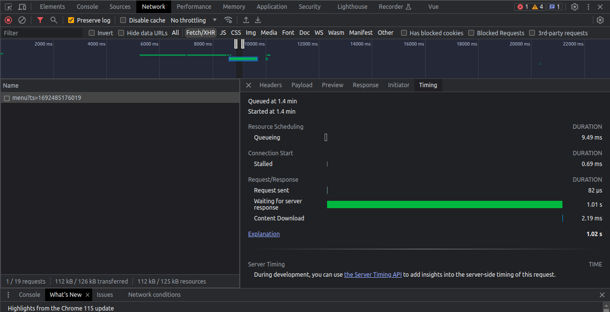
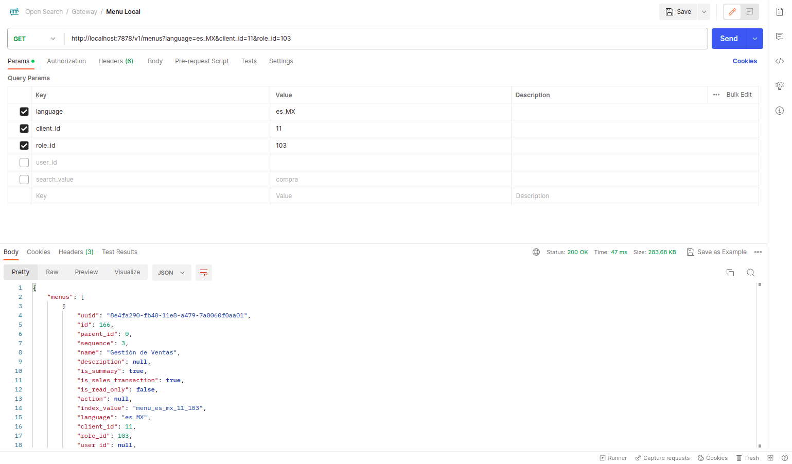

# Microservice with Open Search gateway for ADempiere Dictionary using Rust
A microservice that publish a Rest API based on [salvo.rs](https://salvo.rs/)

Hey! Note that the docker image was changed to [openls/dictionary-rs](https://hub.docker.com/r/openls/dictionary-rs)


## Run Docker Compose (Easy way)

You can run it with `docker compose` for develop enviroment, the complete services are:

- Kafka
- Zookeeper
- OpenSearch
- Dictionary-RS

### Requirements

- [Docker Compose v2.16.0 or later](https://docs.docker.com/compose/install/linux/)

```Shell
docker compose version
Docker Compose version v2.16.0
```

## Run it

Just clone it

```Shell
git clone https://github.com/adempiere/dictionary_rs
cd dictionary_rs/docker-compose
```

```Shell
docker compose up
```

You can use the `-d` parameter to release the terminal.

```Shell
docker compose up -d
```


## Requirements
- Just install [rust](https://www.rust-lang.org/tools/install) from page

```Shell
curl --proto '=https' --tlsv1.2 -sSf https://sh.rustup.rs | sh
```

### Production Requirements

```Shell
apt install pkg-config openssl libssl-dev
```

## Getting Started

### Deploy with docker

You can build images using the follow command

```bash
docker build -t dictionary-rs -f docker/Dockerfile .
```

After build just run it

```bash
docker run -d -p 7878:7878 --name dictionary-rs -e KAFKA_ENABLED="N" -e KAFKA_QUEUES="menu" -e KAFKA_HOST="0.0.0.0:29092" -e KAFKA_GROUP="default" -e OPENSEARCH_URL="http://localhost:9200" dictionary-rs
```

#### Environment variables

- `PORT`: Internal port for container. Default: `7878`
- `KAFKA_ENABLED`: Define if the kafka consumer is enabled. Default: `Y`.
- `KAFKA_QUEUES`: Apply for `KAFKA_ENABLED` flag, this can subscribe to many topics using space between topic. Default: `menu process browser window`.
- `KAFKA_HOST`: Kafka cluster and port for connect. Default: `0.0.0.0:29092`.
- `KAFKA_GROUP`: Kafka group for subscription. Default: `default`.
- `OPENSEARCH_URL`: Open Search service host and port. Default `http://localhost:9200`.
- `RUST_LOG`: The log level for service. Default `info`.
- `TZ`: (Time Zone) Indicates the time zone to set in the nginx-based container, the default value is `America/Caracas` (UTC -4:00).

### Running project
Just build it and run

```Shell
cargo build
cargo run --bin server
```

### Console Output
A output generated by the Arduino UNO emulator can be like it:

```Shell
Server Address: "0.0.0.0:7878"
    └──api
        ├──security/menus
        │   ├──[OPTIONS] -> server::get_menu
        │   └──[GET] -> server::get_menu
        └──dictionary
            ├──processes/<id>
            │   ├──[OPTIONS] -> server::get_process
            │   └──[GET] -> server::get_process
            ├──processes
            │   ├──[OPTIONS] -> server::get_process
            │   └──[GET] -> server::get_process
            ├──browsers/<id>
            │   ├──[OPTIONS] -> server::get_browsers
            │   └──[GET] -> server::get_browsers
            ├──browsers
            │   ├──[OPTIONS] -> server::get_browsers
            │   └──[GET] -> server::get_browsers
            ├──windows/<id>
            │   ├──[OPTIONS] -> server::get_windows
            │   └──[GET] -> server::get_windows
            └──windows
                ├──[OPTIONS] -> server::get_windows
                └──[GET] -> server::get_windows
```

# General Info

## Testing OpenSearch

For test it just run a CURL like this:

```bash
curl --location 'http://localhost:9200'
```

The response:

```json
{
  "name" : "opensearch-node",
  "cluster_name" : "docker-cluster",
  "cluster_uuid" : "BvOe_rh2TUGkLy70abW9Pw",
  "version" : {
    "distribution" : "opensearch",
    "number" : "2.9.0",
    "build_type" : "tar",
    "build_hash" : "1164221ee2b8ba3560f0ff492309867beea28433",
    "build_date" : "2023-07-18T21:23:29.367080729Z",
    "build_snapshot" : false,
    "lucene_version" : "9.7.0",
    "minimum_wire_compatibility_version" : "7.10.0",
    "minimum_index_compatibility_version" : "7.0.0"
  },
  "tagline" : "The OpenSearch Project: https://opensearch.org/"
}
```

For test indices

```bash
curl --location 'http://localhost:9200/_cat/indices'
```

Response:
```log
green  open .opensearch-observability X0Wr0fFwRkG1yC3J44HXKQ 1 0  0 0    208b    208b
yellow open .plugins-ml-config        VkMxei-eShu1qheHm09Wlw 1 1  1 0   3.9kb   3.9kb
yellow open menu_es_mx_100            -Z-4RN-UQemsuly7bycdfw 1 1 11 0 288.3kb 288.3kb
yellow open menu_100                  V9PfwckfTi22c1Wv_RhkAg 1 1 11 0 264.2kb 264.2kb
yellow open menu                      A8Wtsq9KR7O6vjLDi96xXA 1 1 11 0 640.2kb 640.2kb
yellow open menu_es_mx                2DEc951TS1a0Z33UhoZuJg 1 1 11 0   694kb   694kb
```

For delete specific index
```bash
curl -X DELETE 'http://localhost:9200/menu_es_mx_100'
```

For delete all indices with wildcard patterns (`menu`, `menu_100`, `menu_es_mx`, `menu_es_mx_100`...)
```bash
curl -X DELETE 'http://localhost:9200/menu*'
```

The OpenSearch have a defaul size for data, the size is very little and can be increase running 

```bash
curl --location --request PUT 'http://localhost:9200/_all/_settings' \
--header 'Content-Type: application/json' \
--data '{"index.blocks.read_only_allow_delete": null}'
```

## Testing for Kafka

The kafka service can be called from ADempiere using [adempiere-kafka-connector](https://github.com/adempiere/adempiere-kafka-connector), you use two possible ports `29092` and `9092`, internally the dictionary-rs use the `9092`


## Testing OpenSearch-Gateway-rs
The OpenSearch-Gateway-rs is a microservice that is subscribed to `menu` topic from kafka, process menu and store in OpenSearch. Also is used to publish a little `http` service that allows find a menu by index.

For search a index example you can use this:

```bash
curl --location 'http://localhost:7878/api/security/menus?language=es_MX&client_id=11&role_id=103&search_value=compra'
```

Note that the request expect some parameters:
- Language: `language`=`es_MX`
- Client ID: `client_id`=11
- Role ID: `role_id`=`103`
- User ID (Optional): `user_id` 
- Search Value: `search_value`=`compra`

### The index structure is the follow:

- English Menu:
  - Client: `menu_`<client_id>
  - Client + Role: `menu_`<client_id>`_`<role_id>
  - Client + Role + User: `menu_`<client_id>`_`<role_id>`_`<user_id> 
- Translated menu: 
  - Client: `menu_`<language>`_`<client_id>
  - Client + Role: `menu_`<language>`_`<client_id>`_`<role_id>
  - Client + Role + User: `menu_`<language>`_`<client_id>`_`<role_id>`_`<user_id>

### Some Examples

- English Menu:
  - Client: `menu_11`
  - Client + Role: `menu_11_102`
  - Client + Role + User: `menu_11_102_100`
- Translated menu: 
  - Client: `menu_es_mx_11`
  - Client + Role: `menu_es_mx_11_103`
  - Client + Role + User: `menu_es_mx_11_103_100`

## Compare Services

A simple request for adempiere menu using [adempiere-grpc-server](https://github.com/solop-develop/adempiere-grpc-server) take almost **1.02 seconds**.



A request using the [OpenSearch-Gateway-rs](https://github.com/adempiere/dictionary_rs) take almost **47 ms**.



The main reason is that [OpenSearch](https://opensearch.org/) is a special service for queries. You can learn anout it in the [official page](https://opensearch.org/docs/latest/#why-use-opensearch)
